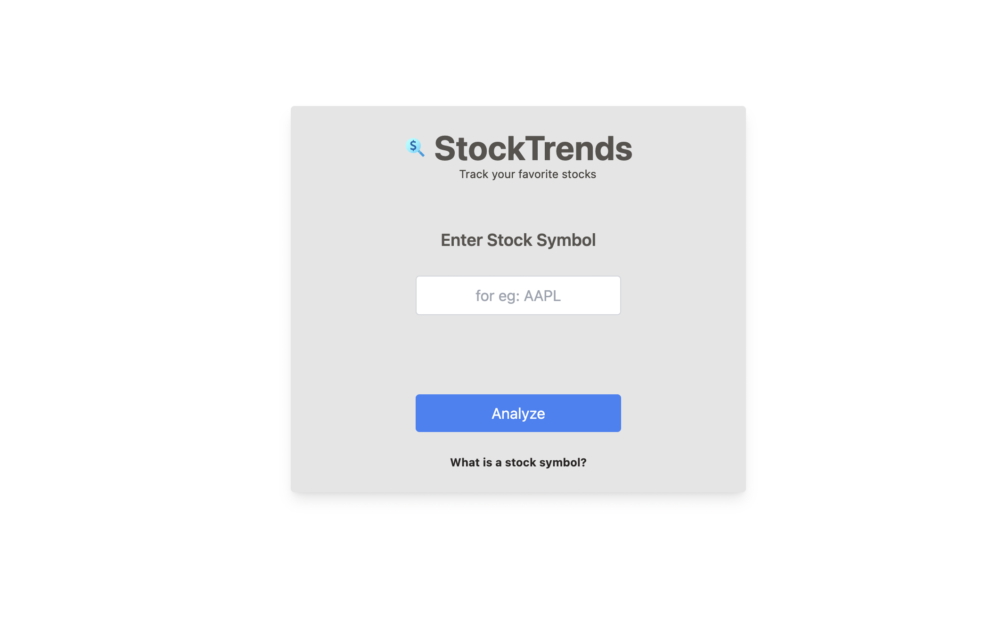
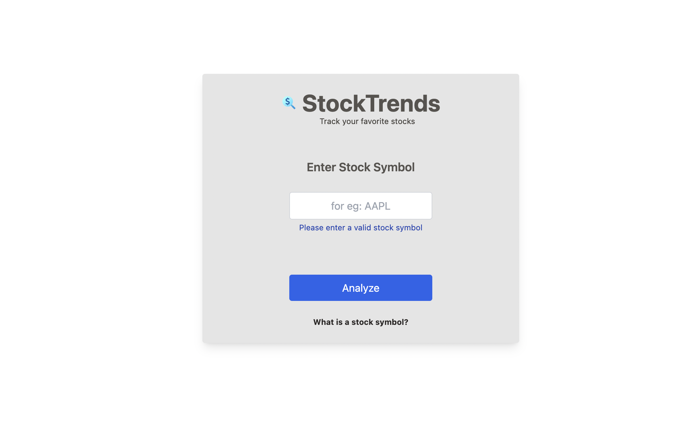
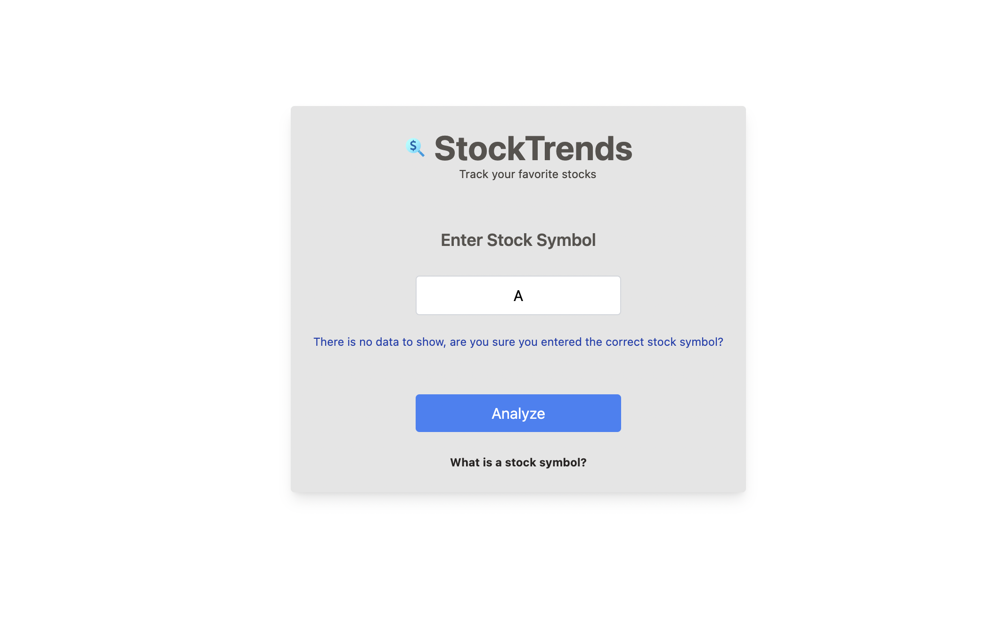
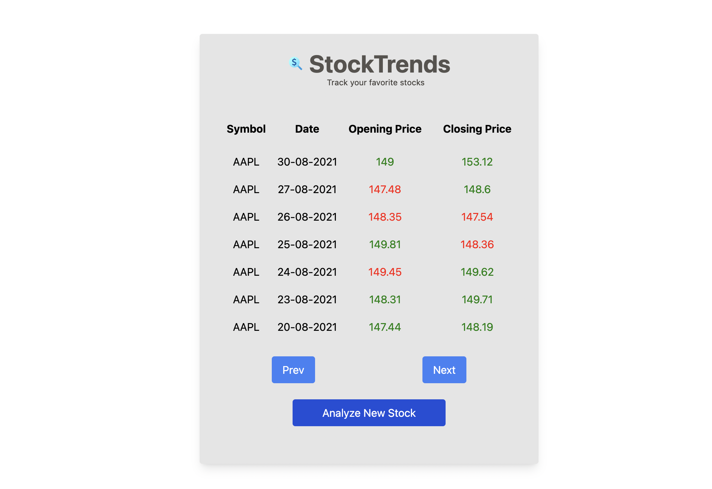
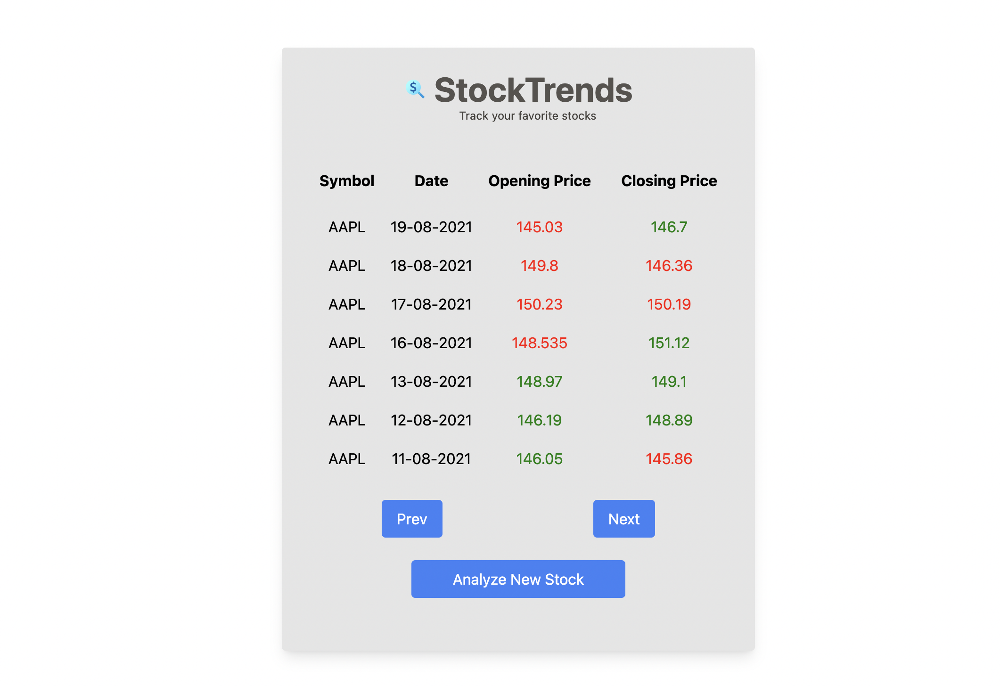

# StockTrends App

StockTrends is a web application designed for tracking your favorite stocks. It allows users to input a stock symbol and then provides information about that stock's trends, such as opening and closing prices for the past week.

## Features

- **Stock Symbol Entry**: Users can input the stock symbol they want to track. The application validates the input for accuracy.

- **Analyze Stock**: Clicking the "Analyze" button fetches the latest stock data and displays it in a tabular format. The data includes information like date, opening price, and closing price for the last week.

- **Prev and Next Navigation**: For convenience, users can navigate through the data using the "Prev" and "Next" buttons, showing data for the previous or next week.

- **Analyze New Stock**: Users can easily switch to analyzing a different stock by clicking the "Analyze New Stock" button.

## Technologies Used

- **Front-end**: The application is built using React, with a modern and responsive user interface.

- **API Integration**: Stock data is fetched from a mock API endpoint using asynchronous JavaScript.

## Getting Started

1. Clone this repository to your local machine.
2. Install the required dependencies using `npm install`.
3. Start the application using `npm run dev`.

## Screenshots

## How to Use

1. Enter the stock symbol in the input field.
2. Click the "Analyze" button to see the stock trends for the past week.
3. Use the "Prev" and "Next" buttons to navigate through the data.
4. To analyze a new stock, click the "Analyze New Stock" button.

## Resources

- [Investopedia - What is a Stock Symbol?](https://www.investopedia.com/terms/s/stocksymbol.asp)
